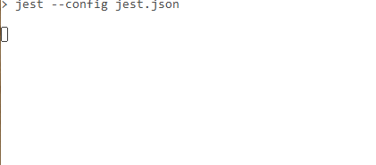
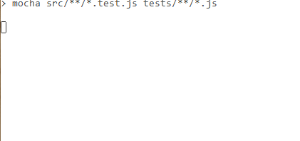

# Jest test

This is an almost empty repo to reproduce an issue with jest - it's taking 13 secs to run.

It only has 2 empty test files (empty describe and it with nothing in them), and no actual code or dependencies (other than jest).

Here's the result of `npm run jest`:

For comparison here's mocha:

